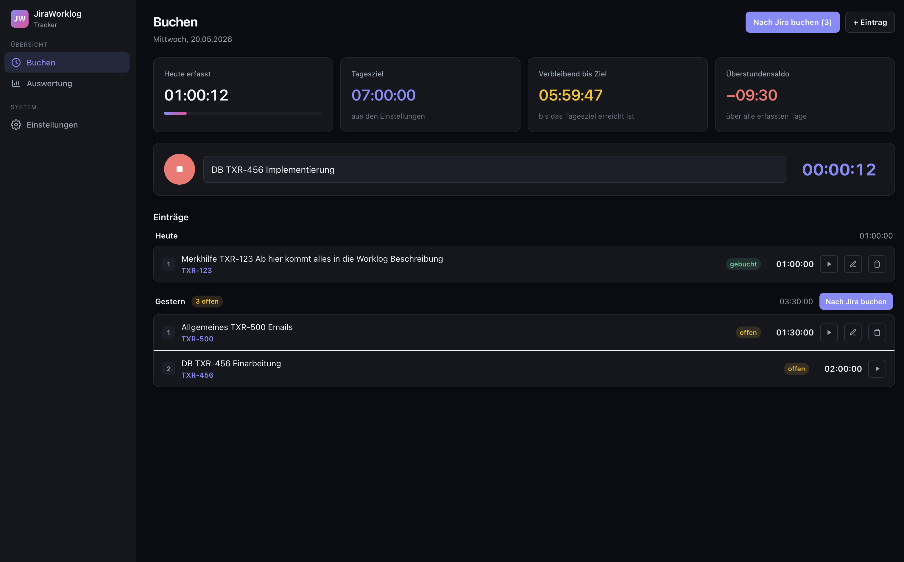

# JiraWorklog Tracker

Eine lokale Web-App zum Erfassen von Arbeitszeiten und direkten Buchen als Worklogs in Jira — ohne Cloud, ohne Account, ohne Abo.



---

## Features

### Zeiterfassung
- **Timer starten/stoppen** — Ein-Klick-Timer mit Live-Anzeige der laufenden Zeit
- **Beschreibungsformat** `Merksatz  ISSUE-123  Worklogtext` — Jira-Issue-Key wird automatisch aus der Beschreibung extrahiert
- **Manuelle Einträge** — Zeiteinträge mit Start- und Endzeit manuell anlegen oder nachträglich bearbeiten
- **Einträge wiederholen** — Laufenden Timer mit gleicher Beschreibung eines bestehenden Eintrags neu starten

### KPI-Dashboard
- **Heute erfasst** — Gesamte erfasste Zeit des aktuellen Tages (inkl. laufendem Timer) mit Fortschrittsbalken
- **Tagesziel** — Konfigurierbare Sollarbeitszeit pro Tag
- **Verbleibend bis Ziel** — Echtzeit-Countdown bis das Tagesziel erreicht ist
- **Überstundensaldo** — Kumuliertes Plus/Minus über alle erfassten Tage

### Jira-Integration
- **Worklog-Vorschau** — Vor dem Buchen wird eine Vorschau aller zu buchenden Worklogs angezeigt
- **Tagesweise oder alles auf einmal buchen** — Pro Tag oder alle offenen Einträge in einem Schritt nach Jira übertragen
- **Buchungsmodi** — Einträge gleicher Beschreibung bündeln (gruppiert) oder jeden Eintrag einzeln buchen
- **API Token & Basic Auth** — Unterstützt sowohl Jira Cloud (API Token) als auch Server/Data Center (Basic Auth)
- **Status-Badges** — Jeder Eintrag zeigt deutlich ob er bereits gebucht (`gebucht`) oder noch offen (`offen`) ist

### „Allgemeines" — Sammelbuchung & Direktbuchung
- **Allgemeines-Issue-Key konfigurierbar** — Ein Jira-Issue, der als Sammeltopf für allgemeine Tätigkeiten dient (z. B. `TXPIV-450`)
- **Pro-Eintrag-Checkbox „Auf Allgemeines buchen"** — Im Timer, in der manuellen Anlage und im Bearbeiten-Dialog: bei aktivierter Checkbox wird die **gesamte Beschreibung** als Worklog-Kommentar verwendet und direkt auf den Allgemeines-Issue gebucht (kein Issue-Key in der Beschreibung nötig)
- **Flag wird beim Neustarten übernommen** — Der Play-Button eines Eintrags startet einen neuen Timer mit demselben Allgemeines-Status
- **Automatische Sammelbuchung** — Optional: Bei Buchungen auf andere Issues wird die Summe aller dieser Zeiten zusätzlich als separater Worklog auf den Allgemeines-Issue gebucht. Direktbuchungen auf Allgemeines zählen nicht in diese Summe.
- **In den Einstellungen deaktivierbar** — Sammelbuchung lässt sich pro Instanz ein- und ausschalten

### Auswertung
- **Tagesbalkendiagramm** — Gearbeitete Zeit pro Tag der letzten 14 Tage als SVG-Balkendiagramm
- **Zeitraum-Filter** — Anzeige für aktuelle Woche, Monat, YTD oder alle Daten
- **Statistische KPIs** — Durchschnittliche Arbeitszeit pro Woche und pro Arbeitstag
- **Wochenstatus** — Verbleibende Zeit bis das Wochensoll erreicht ist

### Pausen & Automatik
- **Automatische Pausenabzüge** — Konfigurierbare Pausenfenster (z. B. 12:00–13:00) werden automatisch von der Zeitberechnung abgezogen
- **Auto-Pause ein/aus** — Pausenabzug kann global deaktiviert werden
- **Kurze Einträge verwerfen** — Timer-Einträge kürzer als 1 Minute werden automatisch verworfen (zu kurz für Jira)

### Einstellungen
- Reguläre Arbeitsminuten (für Überstundensaldo und Wochenstatus)
- Tages-Sollzeit (für den KPI-Countdown)
- Mehrere Pausenfenster konfigurierbar
- Jira-URL, Projekt-Keys, Authentifizierungsmodus
- Allgemeines-Issue-Key und automatische Sammelbuchung (ein/aus)
- Datenhaltung: automatische Bereinigung alter Einträge (konfigurierbare Aufbewahrungsdauer)

---

## Tech Stack

| Layer       | Technologie                                 |
|-------------|---------------------------------------------|
| Framework   | [Next.js 16](https://nextjs.org) (App Router, Server Actions) |
| Sprache     | TypeScript                                  |
| Styling     | Tailwind CSS v4                             |
| Datenbank   | SQLite via [better-sqlite3](https://github.com/WiseLibs/better-sqlite3) |
| ORM         | [Drizzle ORM](https://orm.drizzle.team)     |
| Validierung | [Zod](https://zod.dev)                      |

Alles läuft **lokal** — kein Server, keine Cloud, keine externen Dienste außer deiner Jira-Instanz.

---

## Schnellstart

```bash
# Abhängigkeiten installieren
npm install

# Datenbank migrieren
npm run db:migrate

# Dev-Server starten
npm run dev
```

App läuft dann unter [http://localhost:3000](http://localhost:3000).

---

## Beschreibungsformat

Standardmäßig wird die Beschreibung in drei Teile geparst:

```
Merksatz  ISSUE-123  Worklog-Kommentar für Jira
```

- **Merksatz** — freier Text zur eigenen Orientierung (wird lokal gespeichert, nicht nach Jira gesendet)
- **ISSUE-123** — Jira Issue-Key (muss einem der konfigurierten Projekt-Keys entsprechen)
- **Worklog-Kommentar** — Text der als Kommentar im Jira-Worklog erscheint (optional)

Fehlende Issue-Keys werden mit „kein Issue-Key" markiert und beim Buchen übersprungen.

### Direktbuchung auf Allgemeines

Wenn die Checkbox **„Auf Allgemeines buchen"** am Eintrag (Timer, manuelle Anlage oder Bearbeiten-Dialog) gesetzt ist, wird:

- der Issue-Key nicht aus der Beschreibung geparst,
- die **gesamte Beschreibung** als Worklog-Kommentar verwendet,
- der Eintrag auf den in den Einstellungen konfigurierten Allgemeines-Issue gebucht.

In der Eintragsliste erscheint statt „kein Issue-Key" das Label **Allgemeines**.

### Automatische Sammelbuchung

Ist die Sammelbuchung in den Einstellungen aktiviert und ein Allgemeines-Issue konfiguriert, wird beim Buchen pro Tag **zusätzlich** ein Worklog auf den Allgemeines-Issue erzeugt, dessen Dauer der Summe aller anderen Worklogs des Tages entspricht (ohne Kommentar, in der Vorschau als „(Sammelbuchung)" gekennzeichnet). Direkt auf Allgemeines gebuchte Einträge zählen **nicht** in diese Summe — sie werden ohnehin schon übertragen.
