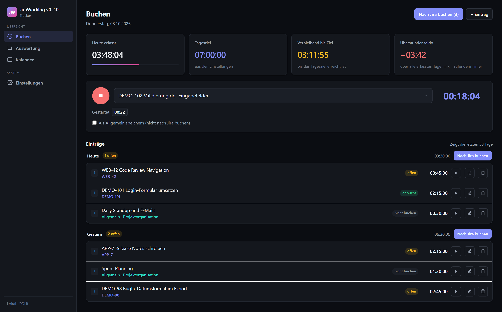
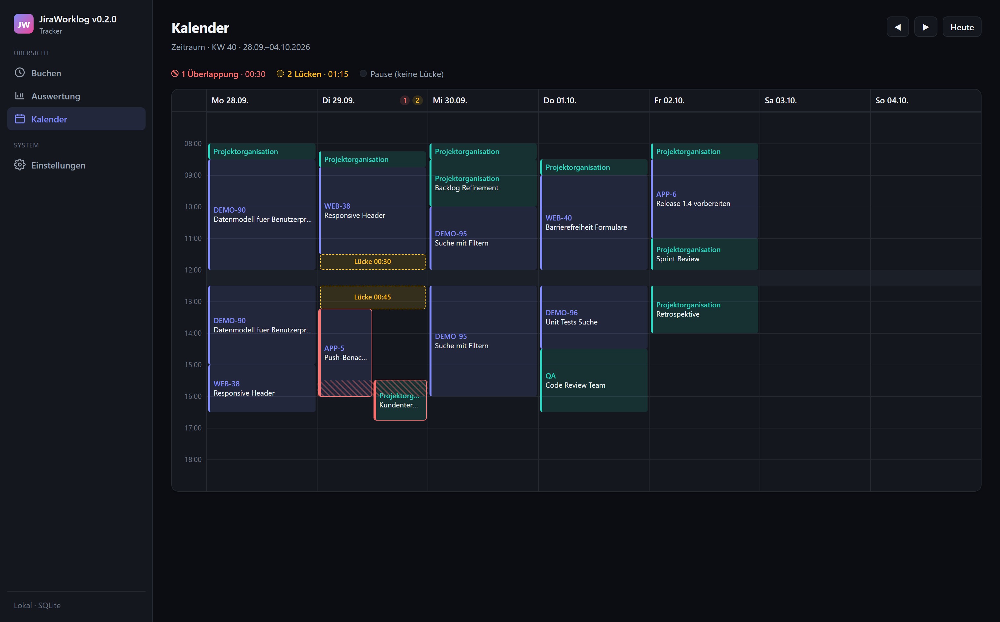

# JiraWorklog Tracker

Eine lokale App zum Erfassen von Arbeitszeiten und direkten Buchen als Worklogs in Jira — ohne Cloud, ohne Account, ohne Abo. Läuft im Browser oder als Windows-Desktop-App mit Tray-Icon.



Änderungen pro Version stehen im [CHANGELOG](CHANGELOG.md).

---

## Features

### Zeiterfassung
- **Timer starten/stoppen** — Ein-Klick-Timer mit Live-Anzeige der laufenden Zeit
- **Beschreibungsformat** `Merksatz  ISSUE-123  Worklogtext` — Jira-Issue-Key wird automatisch aus der Beschreibung extrahiert
- **Vorschläge im Timer-Feld** — Beim Fokus zeigt das Feld die acht zuletzt genutzten Einträge der letzten 30 Tage (mit Issue-Key bzw. Kategorie, Anzahl und Gesamtzeit). Tippen filtert, Pfeiltasten wählen, Enter startet den Timer.
- **Startzeit des laufenden Timers korrigieren** — Zu spät auf Start gedrückt? Die Startzeit lässt sich direkt nachträglich vorverlegen.
- **Manuelle Einträge** — Zeiteinträge mit Start- und Endzeit manuell anlegen oder nachträglich bearbeiten
- **Einträge wiederholen** — Laufenden Timer mit gleicher Beschreibung eines bestehenden Eintrags neu starten
- **Verlauf im Zeitfenster** — Die Liste zeigt standardmäßig die letzten 30 Tage. „Weitere 90 Tage laden“ (`?days=120`) oder „Alles anzeigen“ (`?days=all`) erweitern das Fenster. Saldo und Buchungszähler gelten trotzdem immer für alle Tage.

### Kalender (Wochenansicht)



- **Zeitstrahl pro Woche** — Eine Spalte pro Tag, Stunden auf der senkrechten Achse
- **Überschneidungen** — Überlappende Einträge stehen nebeneinander, die gemeinsame Zeit ist rot schraffiert
- **Lücken** — Nicht erfasste Zeit zwischen erstem und letztem Eintrag eines Tages erscheint gestrichelt
- **Pausen** — Konfigurierte Pausenfenster sind grau und zählen nicht als Lücke
- **Direkt korrigieren** — Klick auf einen Eintrag öffnet denselben Bearbeiten-Dialog wie in „Buchen“. Der laufende Timer wächst live mit, ist hier aber nicht bearbeitbar.

### KPI-Dashboard
- **Heute erfasst** — Gesamte erfasste Zeit des aktuellen Tages (inkl. laufendem Timer) mit Fortschrittsbalken
- **Tagesziel** — Konfigurierbare Sollarbeitszeit pro Tag
- **Verbleibend bis Ziel** — Echtzeit-Countdown bis das Tagesziel erreicht ist
- **Überstundensaldo** — Kumuliertes Plus/Minus über alle erfassten Tage. Läuft live mit, solange ein Timer läuft.
- **Überstunden-Startwert** — Ein Saldo (±hh:mm) aus der Zeit vor der App lässt sich als Startwert eintragen

### Jira-Integration
- **Worklog-Vorschau** — Vor dem Buchen wird eine Vorschau aller zu buchenden Worklogs angezeigt
- **Tagesweise oder alles auf einmal buchen** — Pro Tag oder alle offenen Einträge in einem Schritt nach Jira übertragen
- **Buchungsmodi** — Einträge gleicher Beschreibung bündeln (gruppiert) oder jeden Eintrag einzeln buchen
- **Jira Cloud (Basic Auth)** — Atlassian-Konto-E-Mail und [API-Token](https://id.atlassian.com/manage-profile/security/api-tokens) (kein Bearer-PAT, kein Kontopasswort)
- **Status-Badges** — Jeder Eintrag zeigt deutlich ob er bereits gebucht (`gebucht`) oder noch offen (`offen`) ist
- **Force-Buchung** — Schalter in den Einstellungen, um bereits gebuchte Einträge erneut nach Jira zu senden. Er gilt nur bis zum nächsten App-Neustart. Solange er aktiv ist, zeigt „Buchen“ ein Warnbanner.

### „Allgemeines“ — lokal mit Kategorie
- **Checkbox „Als Allgemein speichern (nicht nach Jira buchen)“** — Im Timer, in der manuellen Anlage und im Bearbeiten-Dialog. Solche Einträge gehen **nicht** nach Jira.
- **Vier Kategorien** — `Projektorganisation`, `Implementierung`, `QA`, `Release`. Die Kategorie wird beim Eintrag gewählt und in der Liste als Badge gezeigt.
- **Flag wird beim Neustarten übernommen** — Der Play-Button eines Eintrags startet einen neuen Timer mit demselben Allgemeines-Status
- **Zählt nicht als offen** — Allgemeines-Einträge erscheinen nicht als ungebuchte Einträge
- **Axapta-Bericht als PDF** — Siehe [Auswertung](#auswertung). Damit wird die Zeit von Hand in einem externen Tool gebucht.

### Auswertung
- **Tagesbalkendiagramm** — Gearbeitete Zeit pro Tag der letzten 14 Tage als SVG-Balkendiagramm
- **Zeitraum-Filter** — Woche, Sprint, Monat, YTD oder alle Daten, mit Vor/Zurück-Navigation
- **Sprints** — Sprint-Ankerdatum und Sprint-Länge (Tage) in den Einstellungen festlegen
- **Statistische KPIs** — Durchschnittliche Arbeitszeit pro Woche und pro Arbeitstag
- **Quote konkrete Issues** — Anteil der Zeit auf echten Jira-Issues (statt Allgemeines), mit Zielwert in % und Diagramm pro Tag
- **Wochenstatus** — Verbleibende Zeit bis das Wochensoll erreicht ist
- **Stundenzettel als PDF** — Alle Einträge des gewählten Zeitraums als PDF herunterladen
- **Axapta-Bericht als PDF** — Zeit pro Allgemeines-Kategorie für einen Monat, aufgeteilt in Blöcke von max. 24 h, mit Prüftabelle pro Tag. Zeit auf konkreten Issues zählt als `Implementierung`.

### Pausen & Automatik
- **Automatische Pausenabzüge** — Konfigurierbare Pausenfenster (z. B. 12:00–13:00) werden automatisch von der Zeitberechnung abgezogen
- **Auto-Pause ein/aus** — Pausenabzug kann global deaktiviert werden
- **Kurze Einträge verwerfen** — Timer-Einträge kürzer als 1 Minute werden automatisch verworfen (zu kurz für Jira)

### Desktop-App (Windows)
- **Installer** — Ein Klick installiert die App pro Benutzer (NSIS, kein Admin nötig)
- **System-Tray** — Tray-Icon mit laufendem Timer. Timer stoppen, Fenster zeigen oder beenden direkt aus dem Tray.
- **Schließen = Minimieren** — Das Fenster geht in den Tray, der Timer läuft weiter
- **Autostart** — Optional beim Windows-Anmelden minimiert im Tray starten
- **Nur eine Instanz** — Ein zweiter Start holt das vorhandene Fenster nach vorne

### Einstellungen
- Regelarbeitszeit (für Überstundensaldo und Wochenstatus) und Überstunden-Startwert
- Tagesziel (für den KPI-Countdown)
- Mehrere Pausenfenster konfigurierbar
- Jira-URL, Atlassian-E-Mail, API-Token, Projekt-Keys, Buchungsmodus, „Verbindung testen“
- Sprint-Ankerdatum, Sprint-Länge und Ziel für die Quote konkreter Issues
- Farbschema: System, Hell oder Dunkel
- Desktop: Autostart (nur in der Desktop-App)
- Datenpflege: alte Einträge löschen (Aufbewahrungsdauer in Tagen). Der Überstundensaldo bleibt dabei erhalten, weil die gelöschten Tage in den Startwert wandern.
- Gefahrenzone: Force-Buchung (gilt nur bis zum Neustart)

### Schutz
- **Scanner- und Flood-Schutz** — Ein Proxy beantwortet typische Angriffs-Anfragen (PHP, CGI, Path Traversal, SQLi …) sofort mit 404, sperrt wiederholende IPs zeitweise und begrenzt Anfrage-Fluten

---

## Tech Stack

| Layer       | Technologie                                 |
|-------------|---------------------------------------------|
| Framework   | [Next.js 16](https://nextjs.org) (App Router, Server Actions) |
| Sprache     | TypeScript                                  |
| Styling     | Tailwind CSS v4                             |
| Datenbank   | SQLite via [better-sqlite3](https://github.com/WiseLibs/better-sqlite3) |
| ORM         | [Drizzle ORM](https://orm.drizzle.team)     |
| Validierung | [Zod](https://zod.dev)                      |
| PDF         | [@react-pdf/renderer](https://react-pdf.org) |
| Desktop     | [Electron](https://www.electronjs.org) + electron-builder (NSIS) |
| Tests       | [Playwright](https://playwright.dev) (E2E)  |

Alles läuft **lokal** — kein Server, keine Cloud, keine externen Dienste außer deiner Jira-Instanz.

---

## Schnellstart

```bash
# Abhängigkeiten installieren
npm install

# Datenbank migrieren
npm run db:migrate

# Dev-Server starten
npm run dev
```

App läuft dann unter [http://localhost:3877](http://localhost:3877).

### Desktop-App

```bash
# Entwickeln: Next-Dev-Server und Electron zusammen starten
npm run electron:dev

# Installer bauen (Ergebnis in release/JiraWorklog-<version>-setup.exe)
npm run electron:build
```

### E2E-Tests

```bash
npm run test:e2e
```

### Jira Cloud

In den Einstellungen die Cloud-URL eintragen (z. B. `https://yourorg.atlassian.net`, ohne Pfad am Ende), Atlassian-E-Mail und API-Token hinterlegen, dann „Verbindung testen“.

### TLS (optional)

Jira Cloud nutzt öffentliche Zertifikate. Für Legacy-On-Prem mit internem CA akzeptiert die App standardmäßig auch nicht vertrauenswürdige Zertifikate (`src/instrumentation.ts`). Zum Erzwingen echter Prüfung: `JIRA_TLS_STRICT=1` setzen und den Server neu starten.

---

## Beschreibungsformat

Standardmäßig wird die Beschreibung in drei Teile geparst:

```
Merksatz  ISSUE-123  Worklog-Kommentar für Jira
```

- **Merksatz** — freier Text zur eigenen Orientierung (wird lokal gespeichert, nicht nach Jira gesendet)
- **ISSUE-123** — Jira Issue-Key (muss einem der konfigurierten Projekt-Keys entsprechen)
- **Worklog-Kommentar** — Text der als Kommentar im Jira-Worklog erscheint (optional)

Fehlende Issue-Keys werden mit „kein Issue-Key" markiert und beim Buchen übersprungen.

### Allgemeines

Wenn die Checkbox **„Als Allgemein speichern“** am Eintrag (Timer, manuelle Anlage oder Bearbeiten-Dialog) gesetzt ist:

- wird der Issue-Key nicht aus der Beschreibung geparst,
- wird eine der vier Kategorien gewählt,
- bleibt der Eintrag **lokal** und wird nie nach Jira gebucht.

In der Eintragsliste erscheint statt „kein Issue-Key" die Kategorie als Badge. Die Zeit landet im Axapta-Bericht unter „Auswertung“.
